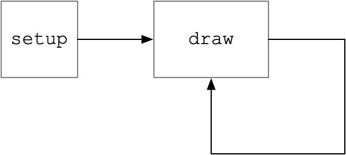

# The setup and draw functions

Here’s the call graph for our program, again. We defined two functions, `setup` and `corners`.

The `setup` function calls `corners`. Who calls `setup`? \(Why does any of the code in `sketch.js` ever get a chance to run?\)

The answer is that p5.js calls `setup`. "setup" is a special name. When you run a p5.js sketch, p5.js looks to see whether it defines a function named "setup". If it does, p5.js calls it when the browser page is loaded.

\(So really, your sketch lives inside of a p5.js sandwhich.\)

“draw” is another function name that is special to p5.js. P5.js calls `setup` once when the web page loads. Then it calls `draw` .

In fact, p5.js calls `draw` over and over again, as long as the web page is open. \(Or, depending on your browser, as long as it is visible.\)

The \(static\) call graph, above, shows which functions call which other functions. A _dynamic call graph_ which shows how many _times_ each function calls each other function.

We can also show this with a _flow chart_. This is yet another kind of diagram, that describes the sequence of processes. Flow charts can be used to describe workflows, industrial processes, or business processes. Sometime in the 1940's, the third-smartest mathematician to ever live used flow charts to plan computer programs before they were written.

